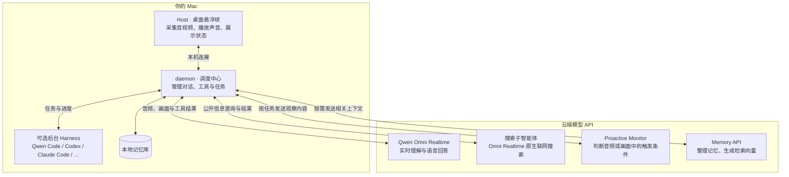

# Qwen-Live-Harness

<p align="center">
  <b>中文</b> ｜ <a href="README_EN.md">English</a>
  <br>
  <a href="#news">News</a> ·
  <a href="#快速开始">快速开始</a> ·
  <a href="#使用与配置">使用与配置</a> ·
  <a href="#开发上手">开发上手</a> ·
  <a href="#架构设计">架构设计</a> ·
  <a href="https://help.aliyun.com/zh/model-studio/user-guide/qwen-omni">API 文档</a>
</p>

<p align="center">
  
</p>

**Qwen-Live-Harness** 是围绕 **Qwen3.8-Omni-Flash-Realtime API** 构建的开源 Harness。一行命令安装，按需接入主流编程智能体，把实时多模态交互、任务委托、主动交互和长期记忆带到桌面。欢迎社区开发者共同扩展后端、交互方式和应用场景。

## News

- **2026-09-17**：🎉 我们正式发布了 **Qwen3.8 Omni Flash Realtime** 和配套的 [**Qwen-Live-Harness**](https://github.com/QwenLM/Qwen-Live-Harness)！

## 可以做什么

- **实时交流**：用语音讨论问题，结合屏幕或摄像头画面理解当前场景。
- **联网查询**：Qwen Omni 先简短回应，再让搜索子智能体查询公开信息，结果就绪后整理答复；搜索失败时，可自动转交已配置的后台 Harness。
- **委托任务**：把工作交给 Qwen Code、Qoder CLI、Codex、Claude Code、Gemini CLI 等后台 Harness，查看进度、处理授权、接收结果。也可按需接入已运行的 Qwen Code 终端，在授权后发送文字指令、接收主动报告。
- **主动交互 · Proactive**：设置音频、画面或时间条件，在事件发生时主动提醒；通知等待当前播报结束后依次播放。
- **长期记忆 · Memory**：跨对话保留偏好和上下文，支持多个记忆库，以及创建、切换和重命名。
- **桌面悬浮球**：切换输入设备、视觉来源和采集模式，管理子智能体；支持中英文界面与浅色／深色主题。

## 快速开始

完整桌面体验目前支持 **macOS 12+**，兼容 Apple Silicon 和 Intel Mac。需要联网调用模型 API，无需下载模型权重或准备本地 GPU。

### 1. 安装 Node.js 和 npm

打开 [Node.js 官方下载页](https://nodejs.org/en/download)，选择 **macOS**，下载安装 **22.13 或更新版本**的 LTS 安装包（`.pkg`），按安装向导完成安装。请同时确认所选 Node.js 版本支持你的 macOS 版本；旧版 macOS 可选择符合要求的 Node.js 22.x。

**npm 会随 Node.js 一起安装，不需要单独下载。** 安装后重新打开“终端”，检查：

```sh
node --version
npm --version
```

第一行应显示 `v22.13.0` 或更高版本，第二行应显示 npm 版本号。

### 2. 获取 DashScope API key

1. 登录 [阿里云百炼控制台的 API key 页面](https://bailian.console.aliyun.com/cn-beijing/model/settings/api-key)，按控制台提示开通模型服务。
2. 选择要使用的服务地域，创建 API key，并确认它有权调用所需的 Realtime 模型。
3. 复制 API key，在下一步初始化时填入。具体操作见 [获取与配置 API Key](https://help.aliyun.com/zh/model-studio/get-api-key)；国际站入口见 [各地域接入信息](https://help.aliyun.com/zh/model-studio/regions)。

初始化支持 **北京（国内站）** 和 **新加坡（国际站）**。北京和新加坡地域的 API key 不能混用，请确认使用的是在所选地域创建的 API key。模型可用范围和调用费用以对应地域的控制台为准。

### 3. 安装、初始化、启动

```sh
npm install -g qwen-live-harness
qwen-live-harness init
qwen-live-harness
```

初始化向导会依次配置语言、后台编程代理、DashScope API key、Realtime 模型、API key 服务地域和 Memory，并在 macOS 上下载安装配套的 **Qwen Live Harness Host**。语言、地域和是／否选项支持左右方向键切换，回车确认。

- **后台 Harness 可选**：尚未安装编程代理，也可以选择不接入，先使用语音、实时画面、Proactive 和 Memory。之后需要任务委托时，再安装并配置后台 Harness。
- **Qwen Code 连接**：选择 Qwen Code 后，默认由 Live 自动启动本地 Qwen Serve，也可连接已有本地服务或使用 ACP。自动启动的服务随 Live 退出；已有服务仍由你独立管理。初始化只保存选择，不启动服务。
- **模型名称**：向导当前默认 `qwen3.5-omni-plus-realtime`。使用 Qwen3.8 Omni Flash Realtime 时，请改为控制台提供的对应模型 ID。
- **Memory 可选**：默认开启；向导会询问记忆整理模型，当前默认 `qwen3.7-plus`。也可以先关闭，稍后在设置中开启。
- **初始化不会开始通话**，只写入配置并完成安装。

启动后，按界面提示授予麦克风和所选视觉来源需要的权限。连接、权限和设备就绪后，会自动开始一次交互。此后既可运行 `qwen-live-harness`，也可从“应用程序”或启动器打开 **Qwen Live Harness Host**。

<details>
<summary>手动安装 Host</summary>

可从 [Releases](https://github.com/QwenLM/Qwen-Live-Harness/releases) 下载与 CLI **版本相同**、适合当前 Mac 架构的 Host `.dmg`。Host 不会代你安装 Node.js 或 CLI；仅下载 Host 的用户仍需先完成上面的终端安装与初始化。

</details>

需要调整模型、输入源或记忆设置时，请参阅 [配置与功能指南](docs/configuration.md)。

## 使用与配置

鼠标移到悬浮球上，可显示麦克风、播报、开始／结束通话、设置和退出按钮。按 **Command + E** 也可以开始或结束通话。

可以试着说：

> “让 Codex 帮我检查这个项目的测试失败原因。”
>
> “记住，我在这个项目里习惯使用 pnpm。”
>
> “监测当前屏幕，出现报错时提醒我。”

在设置中选择 **Audio Source / 音频来源**、**Video Source / 视频来源** 和 **Capture Mode / 采集模式**。屏幕、摄像头都支持按需截图；需要 Omni 持续理解画面时，选择 **Live Feed / 实时画面**。默认实时采集为 **1 FPS、720p**。

打开 **Subagents / 子智能体** 可以查看搜索任务、后台任务和 Monitor、处理权限请求或停止任务。已接入的 Qwen 终端、文字指令送达记录和主动报告会独立展示，不计入普通任务的运行／完成数量。结束通话后，小球变灰但不退出，搜索及其自动转交的查询会停止，其他后台 Harness 任务仍可继续；退出应用则会协调关闭本应用管理的进程。

配置文件默认位于 `~/.qwen-live-harness/config.json`，可通过设置顶部的 **打开 config.json** 用本地编辑器打开。手动修改后重启应用生效。

完整参数、示例、记忆管理和排障方法见 [配置与功能指南](docs/configuration.md)。

## 开发上手

项目内部由两个本机进程协作，对用户提供统一的启动入口：

- **daemon** 是 Node.js 服务，负责连接模型、管理对话、调用工具，以及调度后台 Harness、Proactive 和 Memory。
- **Host** 是 Electron 桌面端，负责悬浮球、系统权限、音视频采集与播放，以及展示任务状态。

两者通过本机 WebSocket 通信：Host 将用户输入交给 daemon，daemon 处理模型与后台任务，再把语音和状态返回 Host。两端使用配套版本，可以分别开发和调试，也可以通过下方的源码入口一起启动。

需要 macOS、Node.js 22.13+ 和 Xcode 命令行工具（可运行 `xcode-select --install` 安装）。Host 构建还需要可用的 Node.js headers，详见 Host 开发指南。

```sh
git clone https://github.com/QwenLM/Qwen-Live-Harness.git
cd Qwen-Live-Harness
npm ci
npm ci --prefix packages/qwen-live-harness-host
npm run init
npm start
```

源码中的 `npm run init` 只完成配置，不下载安装 Host；`npm start` 会构建并同时启动源码 daemon 和 Host，不依赖全局 CLI 或已安装的 Host。开始调试前先退出已有实例。需要日志时使用 `npm start -- --debug`，退出时按 `Ctrl+C`。

| 开发指南                                                   | 内容                                                        |
| ---------------------------------------------------------- | ----------------------------------------------------------- |
| [daemon 开发指南](packages/qwen-live-harness/README.md)    | 模型连接、工具与后端适配、Proactive、Memory、协议和测试。   |
| [Host 开发指南](packages/qwen-live-harness-host/README.md) | Electron 界面、系统权限、音视频、原生截图、窗口布局与打包。 |

已有 Qwen Code 终端的接入、授权和诊断方式见 [Qwen 终端接入](packages/qwen-live-harness/README.md#qwen-终端接入)。

## 架构设计

可以把整个系统理解成三部分：**Host 负责采集和呈现，daemon 负责调度，模型与后台 Harness 负责理解和执行。**



你对着悬浮球提出需求，Omni 理解后直接回答，或请求 daemon 调用工具。编程任务交给后台 Harness；Monitor 的触发结果排队交回主会话播报；Memory 为后续对话提供相关上下文。

了解下面几条，就能更好地选择使用方式：

- **不是所有能力都需要后台 Harness。** 语音、Live Feed、Proactive 和 Memory 可以独立使用；文件修改、命令执行等任务需要已安装并登录的后台 Harness，能力和权限取决于该后端。应用不会自动接管任意终端中的既有任务。
- **Qwen 终端接入需要明确设置。** 通过本地服务可发现已开启跨会话消息的 Qwen 终端；发送文字指令还需控制器授权，接收主动报告需要另行开启。指令“已送达”不等于任务已执行或已完成，也不会替终端批准工具权限。
- **“看画面”有不同路径。** Screen 的 On Demand 截取前台窗口上下文，Live Feed 和视觉 Monitor 采集选定显示器的完整画面；Camera 使用摄像头。按需截图的图片资产不等于已把图片送入主 Omni，直接理解画面请选择 Live Feed。
- **主动监测依赖模型判断。** 创建监测任务后才开始观察，可能误报或漏检；结束通话会停止当前主动监测，不是退出应用后仍常驻的监控服务。
- **记忆存储在本机，推理仍在云端。** 对话、画面和相关记忆上下文会按已启用的功能发送到模型 API，并产生相应用量；本地保存记忆不代表离线推理。
- **平台与并发有实际限制。** 完整桌面功能目前依赖 macOS，Host 连接本机 daemon。应用未设置统一的活动子任务数量上限，但实际并发受后端能力、系统资源和 API 配额限制。原生联网搜索也受模型支持范围限制，有无后台 Harness 都可以使用。

## 社区共建

欢迎通过 [Issues](https://github.com/QwenLM/Qwen-Live-Harness/issues) 分享问题、场景和建议，或提交 [Pull Request](https://github.com/QwenLM/Qwen-Live-Harness/pulls) 参与开发。

报告问题时，请提供版本、系统环境、后端类型、复现步骤及脱敏日志。不要提交 API key、私人对话或未脱敏的屏幕画面；Debug 模式可能保存敏感的音视频与提示词归档。

## 许可证

本项目采用 [Apache License 2.0](LICENSE)。
