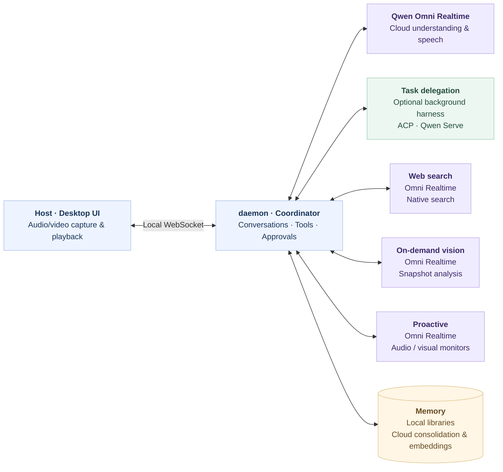

# Qwen-Live-Harness

<p align="center">
  <b>English</b> ｜ <a href="README_ZH.md">简体中文</a>
  <br>
  <a href="#news">News</a> ·
  <a href="#quick-start">Quick start</a> ·
  <a href="#usage-and-configuration">Usage and configuration</a> ·
  <a href="#getting-started-with-development">Getting started with development</a> ·
  <a href="#architecture">Architecture</a> ·
  <a href="https://www.alibabacloud.com/help/en/model-studio/qwen-omni">API documentation</a>
</p>

<p align="center">
  
</p>

**Qwen-Live-Harness** is an open-source harness built around the **Qwen Omni Realtime API**. Install it with one command and connect to popular agent harnesses to bring realtime audio/video interaction, background task delegation, proactive interaction, and long-term memory to your desktop. All source code is open, and community contributions to backends, interaction methods, and use cases are welcome.

## News

- **2026-09-21**: 🎉 We officially released **Qwen3.8 Omni Flash Realtime** and its companion [**Qwen-Live-Harness**](https://github.com/QwenLM/Qwen-Live-Harness) **v1.0.0**!

## What can Qwen Live Harness do?

- **Realtime interaction**: Interact through audio and video with screen or camera context. Switch input devices, visual sources, and capture modes, and manage subagents through the UI.
- **Task delegation**: Hand work to background harnesses such as Qwen Code, Qoder CLI, Codex, Claude Code, and Gemini CLI. Track progress, handle approval requests, and receive results. You can also connect to existing Qwen Code terminals to send authorized text instructions and receive proactive reports.
- **Proactive interaction**: Set audio, visual, or time-based conditions and receive reminders when events occur. Supports audio/video monitoring and live narration.
- **Long-term memory**: Retain preferences and context across conversations, with support for creating, selecting, and renaming multiple memory libraries.

## Quick start

The full desktop experience currently supports **macOS 12+** on Apple Silicon and Intel Macs. It requires an internet connection to the Alibaba Cloud Model Studio DashScope API, but no local model weights or GPU. Support for other platforms, including Windows and Linux, is in progress.

### 1. Install Node.js and npm

Visit the [official Node.js download page](https://nodejs.org/en/download), select **macOS**, and install an LTS release of **Node.js 22.13 or newer** using the `.pkg` installer. Alternatively, install it from a terminal:

```sh
# Download and install nvm:
curl -o- https://raw.githubusercontent.com/nvm-sh/nvm/v0.40.7/install.sh | bash
# in lieu of restarting the shell
\. "$HOME/.nvm/nvm.sh"
# Download and install Node.js:
nvm install 24
```

**npm is included with Node.js; no separate download is required.** Open a new terminal and check:

```sh
node --version
npm --version
```

The first command should report `v22.13.0` or newer, and the second should report the npm version.

### 2. Get a DashScope API key

1. Sign in to the [API key page in the Alibaba Cloud Model Studio console](https://bailian.console.aliyun.com/cn-beijing/model/settings/api-key) and follow the console instructions to enable model services.
2. Select your service region, create an API key, and make sure it can access the Qwen Omni Realtime and Qwen text models you need.
3. Copy the API key and enter it during initialization in the next step. See [Get and configure an API key](https://www.alibabacloud.com/help/en/model-studio/get-api-key) for details and [Regional access information](https://www.alibabacloud.com/help/en/model-studio/regions) for international access.

Initialization supports **Beijing (China)** and **Singapore (international)**. API keys from these two regions are not interchangeable: make sure your key was created in the region you select. Model availability and pricing are determined by the console for that region.

### 3. Install, initialize, and start

```sh
npm install -g qwen-live-harness
qwen-live-harness init
qwen-live-harness
```

The initialization wizard configures your language, background harness, DashScope API key, Realtime model, API key service region, and Memory. Use the left and right arrow keys to select language, region, and Yes/No options, then press Enter to confirm.

After launch, follow the UI prompts to grant microphone access and the permissions required by your selected visual source. You can start interacting once the connection, permissions, and devices are ready. For daily use, run `qwen-live-harness` or open **Qwen Live Harness Host** from Applications or your launcher.

For advanced model settings, see the [configuration guide](docs/configuration.md).

## Usage and configuration

The UI lets you enable or disable the microphone and speaker, start or end a call, open settings, and quit. **Command + E** also starts or ends a call.

Try saying:

> “Clone the Git project on my screen to my computer.”
>
> “Give me a detailed narration of what is on screen.”
>
> “Watch the screen and let me know if the code encounters an error.”
>
> “Tell me about some interesting recent news.”
>
> “Research current developments in AI worldwide and save a summary document to Downloads.”

In Settings, choose your microphone under **Sound**, and the **Video Source** and **Capture Mode** under **Visual**. **On Demand** sends a snapshot of the selected display or camera to an independent visual-analysis subagent, so visual questions work without a background Harness. When the main model needs a continuous view, select **Live Feed**, which defaults to **1 FPS at 720p**.

Open **Subagents** in the UI to inspect visual analyses, web searches, background tasks, and Proactive monitors, handle permission requests, or stop tasks. Monitor observation uses a fixed **1 FPS and two-second chunks**; notifications wait for the ongoing conversation and playback to finish. Sampling and model inference introduce delay and can produce mistakes, so monitoring is not a safety-critical alarm system.

The configuration file is stored at `~/.qwen-live-harness/config.json` by default. Use **Open configuration** in Settings to open it in a local editor. Restart the application after editing it manually.

See the [configuration guide](docs/configuration.md) for the full parameter reference, examples, memory management, and troubleshooting.

### Supported background harnesses

Install and authenticate the harnesses you want to use, then select them during `qwen-live-harness init`. Live launches their background connections for you.

| Harness     | Protocol                            | Connection                                                                                         |
| ----------- | ----------------------------------- | -------------------------------------------------------------------------------------------------- |
| Qwen Code   | Qwen Serve (REST/SSE) or native ACP | Managed local Serve by default; an existing Serve or `qwen --acp` is also supported.               |
| Qoder CLI   | Native ACP                          | `qodercli --acp`                                                                                   |
| Codex       | ACP adapter                         | [`@agentclientprotocol/codex-acp`](https://github.com/agentclientprotocol/codex-acp)               |
| Claude Code | ACP adapter                         | [`@agentclientprotocol/claude-agent-acp`](https://github.com/agentclientprotocol/claude-agent-acp) |
| Gemini CLI  | Native ACP                          | `gemini --experimental-acp`                                                                        |

[ACP (Agent Client Protocol)](https://agentclientprotocol.com/get-started/introduction) connections use JSON-RPC over local standard input/output. Codex and Claude Code adapters are launched through `npx` and may download dependencies on first use. Available tools, image support, and approval behavior depend on the backend and its version.

A background harness is optional: choose none during initialization to use realtime audio/video interaction, web search, Proactive, and Memory.

## Getting started with development

The project uses two cooperating local processes behind one user-facing entry point:

- **daemon** is the Node.js service. It connects to models, manages conversations and tools, and coordinates background harnesses, Proactive, and Memory.
- **Host** is the Electron desktop application. It provides the UI, system permissions, audio/video capture and playback, and task status displays.

They communicate over a local WebSocket: Host sends user input to the daemon, which handles model and background work and returns audio and state updates. The two components use matching versions and can be developed separately or launched together from source.

You need macOS, Node.js 22.13+, and Xcode Command Line Tools, available through `xcode-select --install`. Building Host also requires accessible Node.js headers.

```sh
git clone https://github.com/QwenLM/Qwen-Live-Harness.git
cd Qwen-Live-Harness
npm ci
npm ci --prefix packages/qwen-live-harness-host
npm run init
npm start
```

`npm run init` only configures the source checkout; it does not download or install Host. `npm start` builds and launches both the source daemon and Host without depending on a global CLI or an installed Host application. Quit any existing instance before debugging. Use `npm start -- --debug` for diagnostic logs, and press `Ctrl+C` to exit.

| Developer guide                                               | Contents                                                                                        |
| ------------------------------------------------------------- | ----------------------------------------------------------------------------------------------- |
| [Daemon development](packages/qwen-live-harness/README.md)    | Model connections, tools and backend adapters, Proactive, Memory, protocols, and tests.         |
| [Host development](packages/qwen-live-harness-host/README.md) | Electron UI, system permissions, audio/video, native screenshots, window layout, and packaging. |

Existing Qwen Code terminals use a separate **Qwen peer protocol** for discovery, authorized text instructions, and optional reports; this does not take over arbitrary terminals. See [Qwen terminal integration](packages/qwen-live-harness/README.md#qwen-terminal-integration).

## Architecture

Think of the system as three parts: **Host captures and presents, the daemon coordinates, and models and background harnesses understand and execute.**



Tell Qwen Live Harness what you need. Qwen Omni can answer directly or use tools to delegate complex work to a background harness while the foreground conversation continues. Background results are queued for the main conversation to announce, and Memory provides relevant context for later conversations.

Keep these boundaries in mind when choosing how to use it:

- **Background harness capabilities:** Audio/video interaction, Proactive, and Memory can run independently. File changes and command execution require an installed and authenticated background harness, whose capabilities and permissions determine what can be done. The application does not automatically take over existing work in arbitrary terminals.
- **Different ways to see:** On Demand captures the full selected display or camera and returns the visual subagent's analysis to the main conversation. Live Feed continuously supplies images to the main model. Proactive monitors independently observe the selected source; they do not open webpages or operate applications for you.
- **Local memory, cloud inference:** Personalized and cross-session memories are stored in local libraries you can manage. Memory consolidation, optional visual observation, and embeddings send the relevant content to the configured model APIs; local storage does not mean offline inference.

## Community contributions

Share problems, use cases, and ideas through [Issues](https://github.com/QwenLM/Qwen-Live-Harness/issues), or contribute a [Pull Request](https://github.com/QwenLM/Qwen-Live-Harness/pulls).

When reporting a problem, include the version, operating system, backend type, reproduction steps, and sanitized logs. Do not submit API keys, private conversations, or unsanitized screenshots. Debug logs may contain sensitive audio and video, so review them before sharing.

## License

This project is licensed under the [Apache License 2.0](LICENSE).
