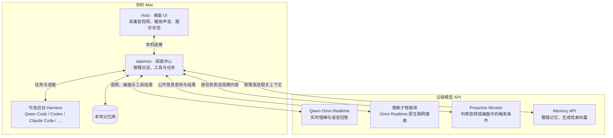

# Qwen-Live-Harness

<p align="center">
  <b>中文</b> ｜ <a href="README.md">English</a>
  <br>
  <a href="#news">News</a> ·
  <a href="#快速开始">快速开始</a> ·
  <a href="#使用与配置">使用与配置</a> ·
  <a href="#开发上手">开发上手</a> ·
  <a href="#架构设计">架构设计</a> ·
  <a href="https://help.aliyun.com/zh/model-studio/user-guide/qwen-omni">API 文档</a>
</p>

<p align="center">
  
</p>

**Qwen-Live-Harness** 是围绕 **Qwen Omni Realtime API** 构建的开源 Harness，使用一行命令安装，即可接入各种主流 Harness 智能体，把实时音视频交互、负责任务后台委托、主动交互和长期记忆带到桌面端，所有源码均开源，欢迎社区开发者共同扩展后端、交互方式和应用场景。

## News

- **2026-09-19**：🎉 我们正式发布了 **Qwen3.8 Omni Flash Realtime** 和配套的 [**Qwen-Live-Harness**](https://github.com/QwenLM/Qwen-Live-Harness)！

## Qwen Live Harness 可以做什么

- **实时交流**：结合屏幕或摄像头以音视频的方式进行交互，支持切换输入设备、视觉来源和采集模式，并可视化管理子智能体。
- **委托任务**：把工作交给 Qwen Code、Qoder CLI、Codex、Claude Code、Gemini CLI 等后台 Harness，并进行查看进度、处理授权、接收结果，也可按需接入已运行的 Qwen Code 终端，在授权后发送文字指令、接收主动报告。
- **主动交互 · Proactive**：设置音频、画面或时间条件，在事件发生时主动提醒，可完成音视频条件监视，实时解说等功能。
- **长期记忆 · Memory**：跨对话保留偏好和上下文，支持多个记忆库，以及对其进行创建、切换和重命名功能。

## 快速开始

完整桌面体验目前支持 **macOS 12+**，兼容 Apple Silicon 和 Intel Mac，需要联网调用阿里云百炼 DashScope API，无需下载模型权重或准备本地 GPU，对 Windows 和 Linux 等其他平台的支持也正在进行中。

### 1. 安装 Node.js 和 npm

打开 [Node.js 官方下载页](https://nodejs.org/en/download)，选择 **macOS**，下载安装 **22.13 或更新版本**的 LTS 安装包（`.pkg`），按安装向导完成安装，或者直接使用命令行在终端安装:

```sh
# Download and install nvm:
curl -o- https://raw.githubusercontent.com/nvm-sh/nvm/v0.40.7/install.sh | bash
# in lieu of restarting the shell
\. "$HOME/.nvm/nvm.sh"
# Download and install Node.js:
nvm install 24
```

**npm 会随 Node.js 一起安装，不需要单独下载。** 安装后重新打开“终端”，检查：

```sh
node --version
npm --version
```

第一行应显示 `v22.13.0` 或更高版本，第二行应显示 npm 版本号。

### 2. 获取 DashScope API key

1. 登录 [阿里云百炼控制台的 API key 页面](https://bailian.console.aliyun.com/cn-beijing/model/settings/api-key)，按控制台提示开通模型服务。
2. 选择要使用的服务地域，创建 API key，并确认它有权调用所需的 Qwen Omni Realtime 模型与 Qwen 文本模型。
3. 复制 API key，在下一步初始化时填入。具体操作见 [获取与配置 API Key](https://help.aliyun.com/zh/model-studio/get-api-key)；国际站入口见 [各地域接入信息](https://help.aliyun.com/zh/model-studio/regions)。

初始化支持 **北京（国内站）** 和 **新加坡（国际站）**。北京和新加坡地域的 API key 不能混用，请确认使用的是在所选地域创建的 API key。模型可用范围和调用费用以对应地域的控制台为准。

### 3. 安装、初始化、启动

```sh
npm install -g qwen-live-harness
qwen-live-harness init
qwen-live-harness
```

初始化向导会依次配置语言、后台任务委托Harness、DashScope API key、Realtime 模型、API key 服务地域和 Memory，语言、地域和是／否选项支持左右方向键切换，回车确认。

启动后，按界面提示授予麦克风和所选视觉来源需要的权限，连接、权限和设备就绪后，即可开始交互，此后运行 `qwen-live-harness`即可启动，也可从应用程序或启动器打开 **Qwen Live Harness Host**。

需要调整模型相关的高级设置时，请参阅 [配置指南](docs/configuration_ZH.md)。

## 使用与配置

可视化 UI 支持打开关闭麦克风和扬声器、开始／结束通话、设置和退出功能，按 **Command + E** 也可以开始或结束通话。

可以试着说：

> “帮我把屏幕上的 Git Project 拉取到本地”
>
> “对当前画面进行一个详细的解说”
>
> “监测当前屏幕，出现代码运行报错时提醒我”
>
> “最近有什么好玩的新闻，给我讲一讲”
> 
> “调研一下目前国际上 AI 的发展情况，总结一个文档到下载目录下”

在设置中可以选择 **Audio Source / 音频来源**、**Video Source / 视频来源** 和 **Capture Mode / 采集模式**，屏幕、摄像头都可以支持按需截图，减少视觉 Token 消耗，在需要持续对输入画面进行理解时，选择 **Live Feed / 实时画面**，默认实时采集为 **1 FPS、720p**。

可以在 UI 中打开 **Subagents / 子智能体** 来查看后台任务和主动交互 Monitor的运行情况，并处理权限请求或停止任务。

配置文件默认位于 `~/.qwen-live-harness/config.json`，可通过设置页面的 **打开 config.json** 用本地编辑器打开，手动修改后重启应用即可生效。

完整参数、示例、记忆管理和排障方法见 [配置指南](docs/configuration_ZH.md)。

## 开发上手

项目内部由两个本机进程协作，对用户提供统一的启动入口：

- **daemon** 是 Node.js 服务，负责连接模型、管理对话、调用工具，以及调度后台 Harness、Proactive 和 Memory。
- **Host** 是 Electron 桌面端，负责 UI 界面、系统权限、音视频采集与播放，以及展示任务状态。

两者通过本机 WebSocket 通信：Host 将用户输入交给 daemon，daemon 处理模型与后台任务，再把语音和状态返回 Host，两端使用配套版本，可以分别开发和调试，也可以通过下方的源码入口一起启动。

需要 macOS、Node.js 22.13+ 和 Xcode 命令行工具（可运行 `xcode-select --install` 安装）。Host 构建还需要可用的 Node.js headers。

```sh
git clone https://github.com/QwenLM/Qwen-Live-Harness.git
cd Qwen-Live-Harness
npm ci
npm ci --prefix packages/qwen-live-harness-host
npm run init
npm start
```

其中 `npm run init` 命令只完成配置，不下载安装 Host，而 `npm start` 会构建并同时启动源码 daemon 和 Host，不依赖全局 CLI 或已安装的 Host。开始调试前先退出已有实例。需要日志时使用 `npm start -- --debug`，退出时按 `Ctrl+C`。

| 开发指南                                                   | 内容                                                        |
| ---------------------------------------------------------- | ----------------------------------------------------------- |
| [daemon 开发指南](packages/qwen-live-harness/README_ZH.md)    | 模型连接、工具与后端适配、Proactive、Memory、协议和测试。   |
| [Host 开发指南](packages/qwen-live-harness-host/README_ZH.md) | Electron UI 界面、系统权限、音视频、原生截图、窗口布局与打包。 |

已有 Qwen Code 终端的接入、授权和诊断方式见 [Qwen 终端接入](packages/qwen-live-harness/README_ZH.md#qwen-终端接入)。

## 架构设计

可以把整个系统理解成三部分：**Host 负责采集和呈现，daemon 负责调度，模型与后台 Harness 负责理解和执行。**



用户可以对着 Qwen Live Harness 提出需求，驱动它的 Qwen Omni 理解后直接回答，或调用工具将复杂的生产任务交给后台 Harness，前台仍可异步进行对话和交互，后台的任务的触发结果后会排队交回主会话播报，此外还有 Memory 为后续对话提供相关上下文。

了解下面几条，就能更好地选择使用方式：

- **后台 Harness 的能力边界：** 音视频交互、Proactive 和 Memory 可以独立使用，文件修改、命令执行等任务需要已安装并登录的后台 Harness，能力和权限取决于该后端。应用不会自动接管任意终端中的既有任务。
- **“看画面”有不同路径：** 整套框架支持不同的视觉输入，可以是用户屏幕也可以是摄像头，并且支持两种采集模式，更节省 Token 消耗，按需模式会在需要时调用工具截取画面，而持续采集模式则会一直将画面信息送入主模型，更关注细节和变化。
- **记忆存储在本地，推理仍在云端：** 用户交流过程中个性化的记忆库和跨 Session 的记忆是保存在本地的记忆库的，它与云端的 API 无关，并且可以对记忆库进行增删查改的管理。

## 社区共建

欢迎通过 [Issues](https://github.com/QwenLM/Qwen-Live-Harness/issues) 分享问题、场景和建议，或提交 [Pull Request](https://github.com/QwenLM/Qwen-Live-Harness/pulls) 参与开发。

报告问题时，请提供版本、系统环境、后端类型、复现步骤及脱敏日志，注意避免提交 API key、私人对话或未脱敏的屏幕画面，在 Debug 模式下保存的日志可能保存敏感的音视频信息，请务必检查后再提交。

## 许可证

本项目采用 [Apache License 2.0](LICENSE)。
